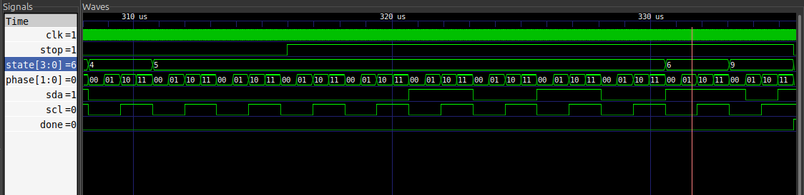
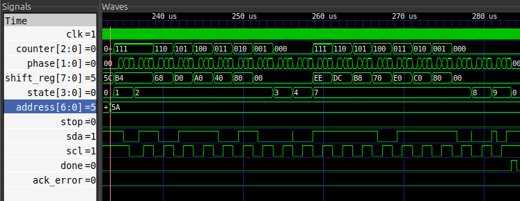
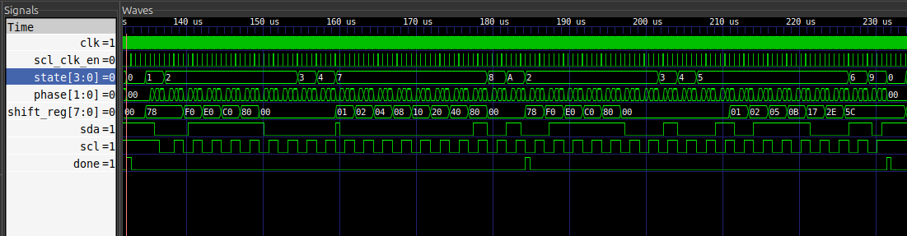
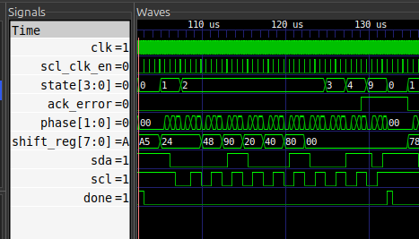
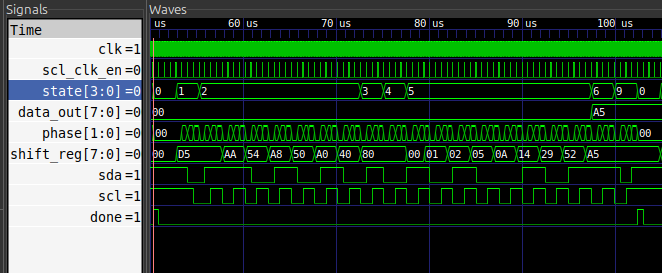
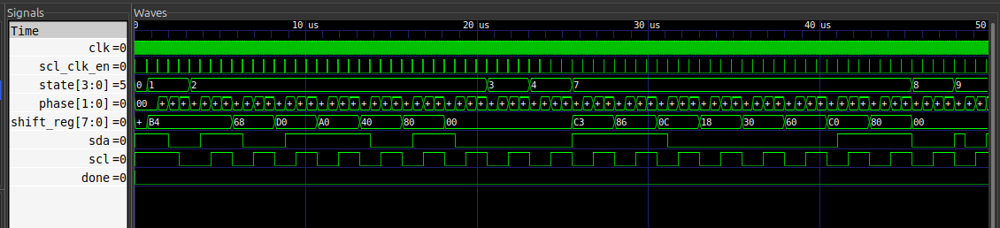

#I2C Master Controller

A fully parameterized I2C Master core simulated with the help of iverilog and GTKwave.
Designed with clock-domain isolation with 4 phase state machine to follow Philips I2C specification.

##Design Highlights
* **Clock Domain Split:**  Fast CPU commands (i.e `start` , `address`) are caught by 50Mhz system clock, while protocol operates on a slower clock pulse.

* **4-Phase State Machine:**  Since the operating frequency of I2C master is 100kHz or 400Khz(in Fast Mode) , we use a prescaled frequency (1.6Mhz) due to which each state takes 4 clock pulse(relative to prescalar frequency) to complete its processes. Thus, each phase works on 400kHz of frequency. This architecture helps us prevent metastability during read cycles by having time for setup/holding data.

* **Repeated Start:**  Supports Repeated Start without going into deadlock or dropping the bus, which helps save time and continue the required task.

* **Mid Transaction Abort:**  Instead of using a destructive hardware reset that deadlocks the bus, the master features a synchronous `stop` priority multiplexer. This allows the CPU to cleanly interrupt a hostile slave mid-read and force the hardware to execute a legal 4-phase I2C STOP condition, safely releasing the SDA line.

* **Ghost Device Detection:**  After sending address to the slave, No Acknowledge is being detected, thus the `ack_error` goes high and machine goes to STOP state. 

## Simulation & Verification

The project includes a comprehensive, automated self checking testbench matrix that verifies:
1. Standard Write/Read transactions.
2. NACK handling and missing device detection.
3. Asynchronous phase delays and setup/hold violations.
4. CPU-forced protocol aborts mid-transfer.

## Simulation & Verification
Run the full verification suite: `make`
Launch the waveform viewer: `make waves`

**1. Mid-Transaction Protocol Hijack (Test Case 6)**
*Proves asynchronous abort capability and safe 4-phase bus release via S_STOP.*

**2. Asynchronous Phase Delay (Test Case 5)**
*Proves the input synchronizer successfully absorbs slave-induced phase shifts.*

**3. Repeated Start Execution (Test Case 4)**
*Proves seamless transition between transactions , bypassing IDLE state directly.*

**4. Ghost Device Detection (Test Case 3)**
*Proves the master correctly catches a missing slave (NACK) and aborts.*

**5. Standard Read Transaction (Test Case 2)**

**6. Standard Write Transaction (Test Case 1)**

